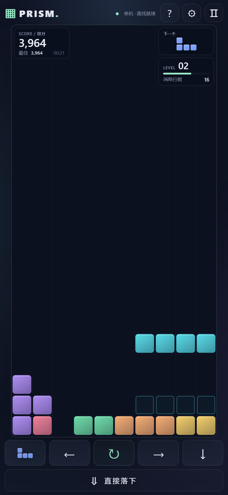
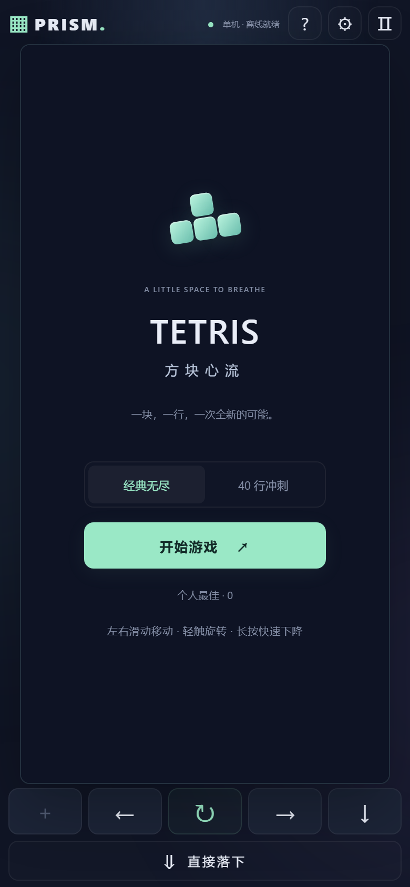
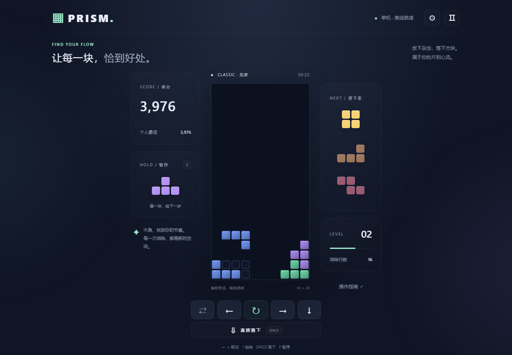

# PRISM · 方块心流

一个竖屏优先、支持离线安装的俄罗斯方块游戏。使用 **TypeScript strict + Canvas + Vite + PWA**，无 UI 框架、无服务器、无外部字体或音频请求。

**在线试玩：<https://funct1ons.github.io/TetrisGame/>**（手机点开即玩，无需下载或安装；加到主屏幕后会以独立窗口全屏启动，可断网游玩）

想发一个文件给别人？用 `portable/PRISM.html`，见下方［备用：发送一个 HTML 文件］。

<p align="center">
  
</p>

## 界面

| 首页（手机）                                                                                                | 对局（桌面）                                                                                                   |
| ----------------------------------------------------------------------------------------------------------- | -------------------------------------------------------------------------------------------------------------- |
|  |  |

两张图都是机器人真实游玩的画面（`npm run screenshots`），不是手工摆拍。

## 让手机用户玩到它：发链接，不要发文件

**把线上地址直接发出去就行**，用户点开即玩，不需要下载、解压或安装任何东西：

```text
https://funct1ons.github.io/TetrisGame/
```

想全屏玩（没有浏览器的地址栏和工具栏），各平台的操作不同：

| 平台                | 操作                                                                           | 结果                                            |
| ------------------- | ------------------------------------------------------------------------------ | ----------------------------------------------- |
| 安卓 Chrome         | 打开链接 → 等右上角出现“离线就绪” → 点页面上的“安装到主屏幕”，或浏览器菜单安装 | 独立窗口，无浏览器界面，断网可玩                |
| 三星浏览器          | 同上                                                                           | 同上                                            |
| iPhone（iOS 16.4+） | Safari 打开 → 分享 → 添加到主屏幕                                              | 全屏启动，无 Safari 界面（`index.html` 已声明） |
| 微信 / QQ 内        | 点开就能玩；想装到桌面要先在右上角菜单选“在浏览器中打开”                       | 内置浏览器不会弹安装入口，但可以正常游玩        |
| 其他安卓浏览器      | 可能只建一个带浏览器角标的快捷方式，点开仍走浏览器                             | 建议改用 Chrome 或三星浏览器                    |

`github.io` 在国内访问速度不稳定。如果主要用户在国内，把 `npm run build` 产出的 `dist/` 原样传到任意国内可访问的静态托管即可，**代码无需改动**。

### 备用：发送一个 HTML 文件

如果对方网络受限，或你就是想发一个文件，用已生成的 **`portable/PRISM.html`**（约 40 KB）。只发送这一个文件即可，不要发送源码或 `dist/index.html`。

用户操作：**保存文件 → 选择浏览器打开 → 点击开始游戏**。代码、样式、音效都在文件里，首次打开也不需要联网，不需要电脑服务、同一 Wi-Fi、解压或安装应用。

注意手机系统限制：

- 微信 / QQ 等内置预览可能禁止运行 HTML，请先下载到“文件 / 下载”目录，再尝试“打开方式 → 浏览器”。
- 不同 Android 文件管理器可能使用 `content://` 或仅提供文本预览，Chrome 不一定会被列为可选应用；此时不能保证一键打开。需要支持运行本地 HTML 的浏览器/文件管理器，或改用上面的公网链接。此限制不是游戏文件能绕过的。
- 这种方式**不能全屏**：浏览器工具栏会一直占着画面，也没有“添加到主屏幕”的独立窗口可用。单文件版不注册 Service Worker；最高分能否持久保存取决于浏览器对本地文件存储的支持，移动/重命名文件也可能使原记录不可见。
- 已通过 Chromium 的本地 `file://` 断网测试及手机触控模拟，尚未在 Android 真机的聊天软件/文件管理器中验收。

修改源码后重新生成：

```sh
npm run build:html  # 输出 portable/PRISM.html，不影响 dist/ 网页版
npm run test:html   # 3 项自动测试，无 HTTP 服务、断网加载本地文件
```

## 开发与运行

需要 Node.js **22.12+**（推荐 Node 24 LTS）。

```sh
npm ci
npm run dev
```

浏览器打开终端显示的地址（默认 `http://localhost:5173`）。手机和电脑连接同一 Wi-Fi，访问 `http://电脑局域网IP:5173`，必要时允许防火墙访问开发端口。普通局域网 HTTP 可以测试游戏，但**不能验证 Service Worker / PWA 安装**。

```sh
npm run build     # TypeScript 检查、生产构建、生成离线资源清单
npm run preview   # http://localhost:4173
npm test          # 19 项逻辑单元测试
npx playwright install chromium
npm run test:e2e  # 自动构建并启动预览，8 项 Chromium 浏览器测试
npm run verify:deploy  # 对线上站点做冒烟测试（可传自定义 URL）
npm run screenshots    # 机器人试玩一局，生成 README 截图到 docs/
npm run format   # 格式化源码
```

PWA 只在生产构建启用，开发环境不会缓存脚本。`dist/` 是完整静态发布目录，不要直接通过 `file://` 打开；要直接打开本地文件，请使用上面的 `portable/PRISM.html`。

## 玩法

- 经典无尽模式；可选 40 行冲刺，达标即结束。
- 10 × 20 可见棋盘，2 行隐藏出生区；7-bag 随机；标准 I / JLSTZ SRS 顺逆旋转与墙踢。
- 500ms 锁定延迟，每块最多 15 次移动/旋转重置，防止无限拖延。
- 落点预览、接下来 3 块预览、Hold 暂存（每次锁定前一次）。
- 单/双/三/四行基础分：100 / 300 / 500 / 800，乘当前等级。
- 连续消行额外 `50 × 连击次数 × 等级`；连续四行消除基础分 ×1.5。无消行的锁定重置连击但保留四行背靠背资格。
- 软降每格 1 分，硬降每格 2 分；每消除 10 行升级，重力加快。
- 圆角渐变、平滑下降、消行粒子、落地反馈、结束动画；合成音效、可关闭震动、减少动态效果设置。
- 最高分、音效/震动/动态设置、主题保存在本机 localStorage。不可用时降级为会话内状态，不阻止游戏。
- 竖屏手机采用“棋盘优先”布局：棋盘占屏高 75%（320×568）到 84%（412×915），无纵向滚动。得分、Next、等级作为半透明芯片浮在棋盘顶部两角，只占两侧各三列，中间四列出生窗口始终无遮挡；堆叠顶到顶部时会自动淡出，避免挡住方块。暂存预览并入触控条按钮（拇指位置），操作指南移到顶栏 `?`。
- 切换标签、锁屏或失去焦点自动暂停；恢复后手动继续。不保存中断棋盘，刷新会回首页。

### 操作

| 操作     | 键盘                   | 手机                       |
| -------- | ---------------------- | -------------------------- |
| 左右移动 | ← / →，支持按住连发    | 左右滑 / 按住左右按钮      |
| 软降     | ↓                      | 下滑 / 长按棋盘 / 按住 ↓   |
| 旋转     | ↑ / X 顺时针，Z 逆时针 | 轻触棋盘 / ↻               |
| 硬降     | Space                  | 直接落下按钮               |
| 暂存     | C / 左 Shift           | ⇄ 按钮（竖屏显示所持方块） |
| 暂停     | P / Esc                | 顶部 Ⅱ                     |

打开设置/指南会暂停游戏，关闭后点击继续。页面不会禁用浏览器缩放；只有棋盘和游戏按钮拦截触控滚动。

## 安装 PWA 与离线

1. 将 `dist/` 部署到 **HTTPS** 站点（本机 `localhost` 也是安全上下文）。
2. Android Chrome 首次联网访问，等待右上角显示“离线就绪”。
3. 点击页面出现的“安装到主屏幕”，或 Chrome 菜单 →“安装应用 / 添加到主屏幕”。浏览器决定是否展示安装提示。
4. 从桌面图标进入独立窗口。完成首次缓存后可断网启动和游玩。

Manifest 由 `vite.config.ts` 生成至 `dist/manifest.webmanifest`（标准 Web App Manifest 格式）。包含 192/512 PNG 图标和独立 maskable 图标；图标源生成脚本为 `scripts/generate-icons.mjs`。

`src/pwa/service-worker.ts` 使用 Workbox 预缓存 HTML、带内容哈希的 JS/CSS、图标和 manifest。新版本安装后等待旧窗口全部关闭再激活，避免更新打断对局。清理网站数据、浏览器回收缓存或首次未完整加载后，需联网重新缓存。离线不依赖 CDN。

## 部署

### 任意静态托管（Cloudflare Pages / Netlify / Vercel 等）

- 构建命令：`npm run build`
- 输出目录：`dist`
- Node：22.12+ / 24
- 开启 HTTPS。发布整个目录，不要只上传 `index.html`。
- `service-worker.js` 和 `index.html` 建议使用 `Cache-Control: no-cache`；哈希资源可以长期缓存。
- `base: './'` 支持子目录发布，使用以 `/` 结尾的入口 URL。

### GitHub Pages

仓库已启用 GitHub Pages（Source: **GitHub Actions**），线上地址：<https://funct1ons.github.io/TetrisGame/>。

推送至 `main` 后会自动运行测试、构建并发布；单文件版作为 workflow artifact **PRISM-single-file** 上传。若默认分支不是 main，请修改 `.github/workflows/deploy.yml` 的触发分支。

部署后可本地验证：

```sh
npm run verify:deploy                                  # 默认检查本项目 Pages
node scripts/verify-deploy.mjs https://example.com/    # 检查任意地址
```

该脚本会用手机视口打开站点，确认 Service Worker 就绪、开始游玩得分，然后断网重载并再游玩一次。

## 工程结构

```text
src/
  game/         Board、Piece / SRS、Tetromino、Game 状态机、Randomizer、Scoring
  rendering/    CanvasRenderer（DPR、插值、粒子、消行动画）
  input/        KeyboardInput（DAS / ARR）、TouchInput（Pointer Events）
  audio/        AudioManager（用户交互后解锁 Web Audio）
  ui/           UIManager、Storage
  pwa/          service-worker.ts、register.ts
  main.ts       requestAnimationFrame、模块接线与生命周期
  style.css     桌面布局、主题、横屏与减少动态效果
  mobile.css    竖屏手机的棋盘优先布局与紧凑控件
public/         本地图标
scripts/       图标生成、截图机器人、部署验证脚本
docs/          README 使用的截图
tests/         Vitest 游戏逻辑测试
 e2e/           Playwright 生产浏览器测试
```

游戏逻辑不依赖 DOM；渲染不会修改棋盘。动画与逻辑帧时间分离，页面后台不追赶丢失的时间；高 DPI 上限为 3，粒子最多 240。目标为 60 FPS，实际帧率需要在目标 Android 设备上验证。

这不是完整 Guideline 认证实现：尚未实现 T-spin 识别、完美清空加分、多人及云端存档。后续可以在独立 Scoring / Game 模块扩展。

## 测试与验收

已自动验证：

- 19 项单元测试：顺逆旋转、I 墙踢、T 地板踢、阻塞旋转、边界/堆叠碰撞、多行消除、计分、等级、7-bag、Hold 限制、锁定延迟及 15 次上限、暂停、出生阻塞、冲刺胜利、重开。
- 8 项 Chromium 测试：390×844、393×727、412×915、320×568、844×390、1440×900 六种尺寸的布局；开始/落下/暂停/设置持久化；模拟触控滑动/按钮；**生产 Service Worker 断网重载并游玩**。
- 布局回归断言：棋盘保持 1:2、竖屏占用屏高 ≥80%（矮屏 ≥73%）、控件不被裁切、页面不横向/纵向溢出、浮层内容不被裁剪、手机上“安装”按钮不遮挡右上角图标、棋盘内 HUD 不越出棋盘且不侵入中间四列出生窗口、HUD 不吃棋盘手势、`?` 入口在手机上可见。
- 截图输出到 `test-results/`（不提交）。`npm run screenshots` 会驱动一个落子机器人真实游玩一局并生成 `docs/` 里的 README 截图：棋盘状态由 `getImageData` 采样 canvas 得到，方块序列从 `#next` 预览读出，落点用 Dellacherie 特征评分选择。该机器人的形状、旋转与碰撞模型独立重写自 `src/game`，实测 60 块中预测落点与实际结果零偏差，可作为渲染与规则的交叉验证。

### Android 真机手工验收清单（发布前执行）

- [ ] Chrome 首次访问：所有方块及文字清晰，无横向溢出。
- [ ] 竖屏 / 横屏切换，检查棋盘比例、按钮可达性、安全区。极小屏可纵向滚动。
- [ ] 点击旋转、左右滑动、下滑、长按软降、虚拟按钮连发；松手及多指操作不残留输入。
- [ ] 连续游玩 10 分钟，验证音效、消行、等级、Hold 和游戏结束。
- [ ] 锁屏 / 切后台自动暂停，回到游戏不会突然硬降或自动继续。
- [ ] 音效首次触摸后正常，关闭声音和震动立即生效；减少动态效果可用。
- [ ] 主屏安装、独立窗口启动、系统返回及任务切换。
- [ ] 首次显示离线就绪后，飞行模式关闭并重新打开 PWA，完整游玩一局。
- [ ] 发布新版：旧局不中断，关闭所有窗口并重新打开后更新。
- [ ] 最高分、主题重启后保留；清除浏览器数据后安全回到默认值。
- [ ] 中低端 Android 实机帧率与发热检查（桌面仿真不能替代真机）。

音效为代码合成，图标为项目自绘，无第三方图片素材。公开商业发行前请自行核查 Tetris 名称及相关品牌/玩法呈现的授权要求。
